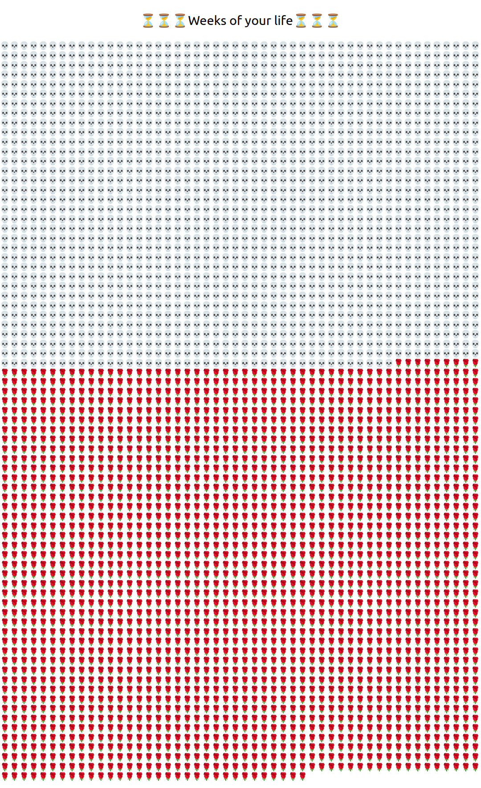

# Motivation 

Memento mori is an old and recurring philosophical idea that one should be mindful of the finiteness of life. See [the wiki page](https://en.wikipedia.org/wiki/Memento_mori#History_of_the_concept) for the history of the concept. 

I am battling my tendency to procrastinate and lose my focus. One bad habit I have in front of a computer is that I open up new browser tabs and start going to random websites. This way, bits and bits of time leaks throughout the day. A habit consists of a cue, which leading to routine, and once performed you get a reward. 

For me, opening new tabs and browsing stuff is a way to escape the feeling of having to focus on the task at hand, perceived to be dreadful/tedious/boring. Once tab is open and I go to a time waster site, the small dose of dopamine received keeps the habit alive, even if in retrospect I feel bad about it. 

The idea of the extension is to hijack the new tab page. By reminding myself of the heavy (but true) fact of the finiteness of life, it pulls me back to the present, sort of a whack in the back of the head, to focus. 

I chose the symbolisms of clock, skull, and rose, to represent time, death, and life, respectively. This symbolism is not arbitrary but have a history. For instance, can be seen in [Phillippe de Champaigne's vanitas](https://commons.wikimedia.org/wiki/File:StillLifeWithASkull.jpg). You can even [buy coins](https://store.dailystoic.com/products/memento-mori) with these 3 symbols engraved on it. 

I got the idea of the visualization from the very nice but sobering [Wait but why blog article "The Tail End](https://waitbutwhy.com/2015/12/the-tail-end.html). I wanted to have something similar that shows my entire life on a single page, but obviously with more flexibility on the inputs. 

Is this a bit too macabre? Sure. But it seems to work, at least, for me. 

I also optimized the look and feel for my 1920x1080 monitor in portrait mode. Pull requests welcome for tweaking it for other monitor/screen sizes. 

# How it works 

When you open a new tab, you are shown a visualization of life. 

The skulls mark the part of your life in the past. The rose mark the part of your life in the future. 

Settings:
* You can choose to see the visualization in units of days, weeks, months, or years. 
* You can also enter your birthday so it can track how long to show you. 

Here's what it looks like


# Technical stuff 

I used the [boilerplate](https://github.com/lxieyang/chrome-extension-boilerplate-react) as a starting point to put together the extension. 

## Dev build 

1. Check if your Node.js version is >= 14.
2. Run npm install to install the dependencies.
3. Run npm start
4. Load your extension on Chrome following:
    1. Access chrome://extensions/
    2. Check Developer mode
    3. Click on Load unpacked extension
    4. Select the build folder.

## Release build

```
NODE_ENV=production npm run build
```
Then pack it up. 

# Possible directions for enhancement 
* i18n for the messages
* customization of the symbols for time, death, and life (although, I feel that the skull is non-negotiable)
* customization of the message displayed
* improve rendering time. the rendering delay for days is especially noticeable
* tweaking the look and feel for other screen sizes as currently it's tweaked for my 1920x1080 screens in either portrait or landscape orientation
* allow you to input your birthday, gender and country as a setting, in order to use a more accurate life expectancy. this implies we need to pull in life expectancy data, and periodically update them (although, it is weird if you suddenly get a bunch of 🌹 because life expectancy went up; I don't believe in freebies in life :0)

# License 

MIT. Pull requests welcome. 